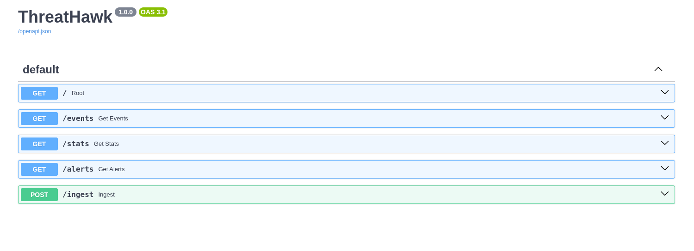
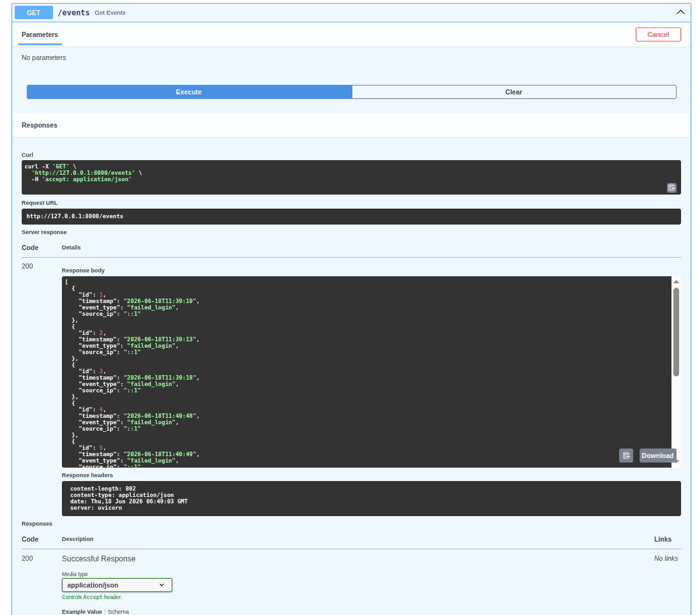
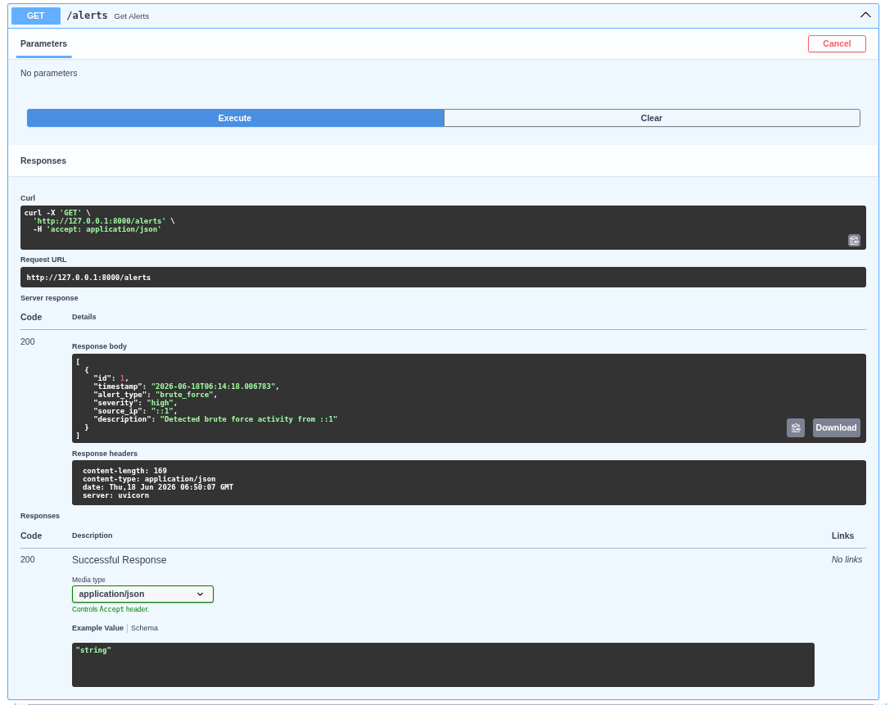
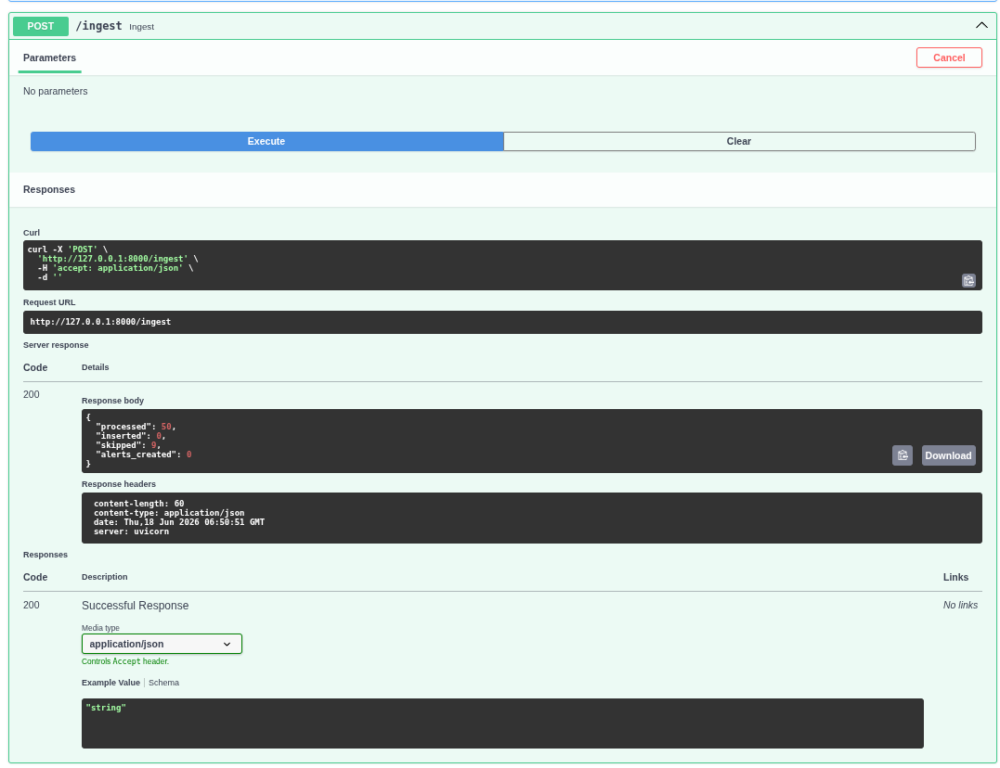

# ThreatHawk


ThreatHawk is a lightweight SIEM-inspired security monitoring platform built with Python, FastAPI, SQLite, and Linux system logs.

It collects SSH authentication events from Linux journals, stores them in a database, detects brute-force login activity, generates security alerts, and exposes data through REST APIs.

---

## How It Works

1. SSH authentication logs are collected from Linux system journals using `journalctl`.
2. Logs are parsed and normalized into structured events.
3. Events are stored in a SQLite database.
4. The detection engine analyzes events for suspicious patterns.
5. Alerts are generated and stored.
6. FastAPI exposes events, statistics, and alerts through REST APIs.

## Overview

Traditional SIEM platforms can be complex and resource-intensive.

ThreatHawk was built as a lightweight security monitoring platform to demonstrate core SOC and SIEM concepts such as log collection, event normalization, attack detection, alert generation, and API-driven monitoring.

## Features

- SSH log collection from systemd journal
- Event parsing and normalization
- SQLite event storage
- Duplicate event prevention
- Brute-force attack detection
- Alert generation and persistence
- FastAPI REST API
- Interactive Swagger documentation

---

## Architecture

```text
SSH Logs (journalctl)
        ↓
Collector
        ↓
Parser
        ↓
SQLite Database
        ↓
Detection Engine
        ↓
Alert Engine
        ↓
FastAPI API
```

---

## Screenshots

The following screenshots demonstrate ThreatHawk's API endpoints and security monitoring capabilities.

### API Documentation



### Events API



### Alerts API



### Ingestion Results



---

## Tech Stack

- Python 3
- FastAPI
- SQLite
- SQLAlchemy
- Uvicorn
- Linux (Kali)
- Journalctl

---

## API Endpoints

| Method | Endpoint | Description |
|----------|----------|-------------|
| GET | `/` | Health Check |
| GET | `/events` | View stored events |
| GET | `/stats` | Event statistics |
| GET | `/alerts` | View generated alerts |
| POST | `/ingest` | Collect and process SSH logs |

---

## Detection Logic

### Brute Force Login Detection

ThreatHawk currently detects brute-force attacks using the following rule:

```text
5 failed login attempts
from the same IP address
within 5 minutes
```

### Alert Example

```json
{
  "alert_type": "brute_force",
  "severity": "high",
  "source_ip": "::1"
}
```

---

## Example Event

```json
{
  "id": 1,
  "timestamp": "2026-06-18T11:39:10",
  "event_type": "failed_login",
  "source_ip": "::1"
}
```

---

## Installation

### Clone Repository

```bash
git clone https://github.com/Riisshi/ThreatHawk

cd ThreatHawk
```

### Create Virtual Environment

```bash
python3 -m venv venv

source venv/bin/activate
```

### Install Dependencies

```bash
pip install -r requirements.txt
```

---

## Running ThreatHawk

### Create Database

```bash
python -m scripts.create_db
```

### Start API Server

```bash
uvicorn backend.main:app --reload
```

### Open Swagger UI

```text
http://127.0.0.1:8000/docs
```

---

## Sample API Responses

### GET /stats

```json
{
  "total_events": 9,
  "failed_logins": 9,
  "successful_logins": 0
}
```

### POST /ingest

```json
{
  "processed": 50,
  "inserted": 0,
  "skipped": 9,
  "alerts_created": 0
}
```

### GET /alerts

```json
[
  {
    "id": 1,
    "timestamp": "2026-06-18T06:14:18",
    "alert_type": "brute_force",
    "severity": "high",
    "source_ip": "::1",
    "description": "Detected brute force activity from ::1"
  }
]
```

---

## Project Structure

```text
ThreatHawk/
│
├── backend/
│   ├── __init__.py
│   ├── alert_engine.py
│   ├── collector.py
│   ├── database.py
│   ├── detector.py
│   ├── ingestor.py
│   ├── main.py
│   ├── models.py
│   └── parser.py
│
├── screenshots/
│   ├── alerts-api.png
│   ├── events-api.png
│   ├── ingest-api.png
│   └── swagger-dashboard.png
│
├── scripts/
│   ├── create_db.py
│   ├── generate_alerts.py
│   ├── ingest_ssh.py
│   ├── load_logs.py
│   ├── view_alerts.py
│   └── view_events.py
│
├── tests/
│   ├── test_collector.py
│   ├── test_detector.py
│   └── test_parser.py
│
├── .gitignore
├── README.md
└── requirements.txt
```

---

## Future Improvements

- Real-time monitoring
- Alert suppression windows
- Docker deployment
- Web dashboard
- Multiple log sources
- Email notifications
- Telegram alerts
- Threat intelligence integration
- Geo-IP enrichment
- MITRE ATT&CK mapping

---

## Author

**RishiKhanth**

B.Tech CSE Cyber Security  
Christ (Deemed to be University)

---

## License

This project is intended for educational and research purposes.